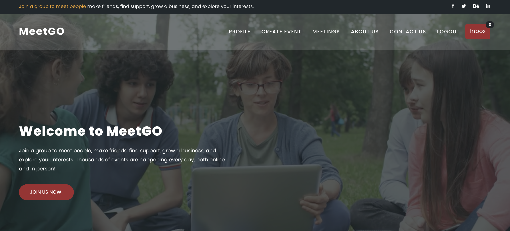

> Index Page

> Demo

We are publish this web site on heroku.

Link : <a href="https://meetgoo.herokuapp.com/">here</a>

> Definations:

This <b>project</b> is a homework project in a university course.

> Contributors 

* <a href="https://github.com/AliYmn">Ali Yaman</a> (<a href="https://www.linkedin.com/in/aliyaman/">Linkedin</a>)
* <a href="https://github.com/aysenurdemirkaya">Ayşe Nur Demirkaya </a>(<a href="https://www.linkedin.com/in/ay%C5%9Fe-nur-demirkaya-4a438418a/?originalSubdomain=tr">Linkedin</a>)

> General Purpose 

MeetGO is a social network that facilitates real-life group MeetGOs. The MeetGO website allows its members to find and join groups created by people with the same interests as politics, books, games, movies, health, pets, career and many more also This project for software development with standard and software quality and testing lecuture.

> Features

* Create/Update Event
* Join Event
* Subscription Organizer
* Notifications : The organizer you follow is notified when the event is created.
* Profile Page
* Our Event,follow and subscriptions on your profile page.

